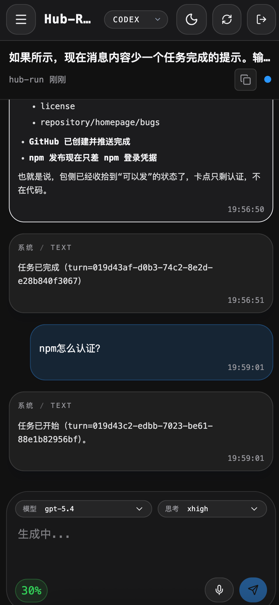

# hub-run

> A unified web shell for local Codex and Claude CLI sessions — browse, send, stream conversations, and dictate with voice from any browser.

[中文文档](./README.zh.md)

---

## Screenshots

<p align="center">
  
</p>

<p align="center">
  
  
</p>

---

## Why hub-run

| | [codex-run](https://github.com/asfsdsf/codex-run) | [claude-run](https://github.com/kamranahmedse/claude-run) | happy | **hub-run** |
|---|---|---|---|---|
| Codex support | ✅ | ❌ | ✅ | ✅ |
| Claude support | ❌ | ✅ | ✅ | ✅ (basic) |
| Multi-provider UI | ❌ | ❌ | ✅ | ✅ |
| Real-time sync | ❌ | ❌ | ✅ | ✅ |
| Voice input / control | ❌ | ❌ | ✅ | ✅ |
| Interrupt / thread state | ❌ | ❌ | ❌ | ✅ |
| User input requests | ❌ | ❌ | ❌ | ✅ |

**codex-run / claude-run** are single-provider shells without streaming — they poll or page-refresh to show new messages.

**happy** is a mobile/web client plus CLI wrapper for Claude Code and Codex, built around end-to-end encrypted remote access and sync. **hub-run** is a self-hosted local HTTP shell that serves its own React UI and talks to local providers directly, without a companion app or relay service.

Use **happy** if you want encrypted remote control from mobile/web and are fine starting sessions through the `happy` / `happy codex` wrapper. Use **hub-run** if you want a browser shell for your existing local Codex / Claude workflow, keep using the original `codex` / `claude` commands, and inspect sessions over local HTTP without wrapping the CLI first.

hub-run runs as a persistent background service, exposes a Hono REST+SSE API, and serves a React SPA — no Electron, no desktop runtime required.

> Claude support is intentionally minimal. Anthropic already provides a full-featured web Channel; effort here is focused on the Codex experience.

---

## How it works

```
Browser (React SPA)
    │  HTTP + SSE
    ▼
Hono API Server (Node.js)
    ├── Codex Provider  ──► codex app-server  (JSON-RPC over stdio)
    │                           thread/start · turn/create · thread/resume
    └── Claude Provider ──► claude CLI  (spawned subprocess per message)
```

### Codex

Communicates with the persistent `codex app-server` process via JSON-RPC over stdio. Session files live in `~/.codex/sessions/*.jsonl` and are watched by a filesystem watcher; changes are pushed to the browser via SSE without polling.

Key RPC calls: `thread/start` → `turn/create` → `thread/read` / `thread/resume`

### Claude

Spawns `claude --resume <id> --print` per message. Session files live in `~/.claude/projects/**/*.jsonl`. Given the official Claude web Channel, this transport is kept simple.

### Real-time delivery

Two SSE streams per browser session:
1. **Session list stream** — incremental upsert/remove of session metadata as files change
2. **Conversation stream** — appends new messages as the AI generates them

### Voice input (ASR)

The browser captures microphone audio and streams raw PCM chunks to the hub-run API over WebSocket. The API forwards chunks to a pluggable ASR provider (currently **[Doubao / ByteDance streaming ASR](https://github.com/starccy/doubaoime-asr)** via their Protobuf protocol over WebSocket). Interim and final transcription results are pushed back to the browser in real time and inserted into the composer as the user speaks.

ASR provider interface is abstract — alternative providers (Whisper, etc.) can be added by implementing `AsrProvider`.

---

## Quick start

```bash
# Install from npm
npm install -g hub-run

# Run with defaults (127.0.0.1:12001)
hub-run

# Or run with explicit password / port
hub-run --password your-password --port 12125

# Build from source
pnpm install
pnpm build

# Background service (recommended, macOS launchd)
pnpm runtime:install -- --port 12125 --password your-password \
  --trusted-origin http://127.0.0.1 \
  --trusted-origin http://localhost

# Dev mode
pnpm dev
```

### Service management

```bash
pnpm runtime:install    # register + bootstrap the launchd user agent
pnpm runtime:start      # start
pnpm runtime:stop       # stop
pnpm runtime:restart    # restart
pnpm runtime:status     # status
pnpm runtime:reload     # build + restart
pnpm runtime:uninstall  # uninstall
```

### macOS daemon mode

On macOS, `pnpm runtime:install` registers hub-run as a `launchd` user agent so it can keep running in the background without leaving a terminal open. The generated runtime config is stored under `~/.config/hub-run/`, and the LaunchAgent plist is written to `~/Library/LaunchAgents/`.

If you want login-time auto start, `pnpm runtime:install` is the switch: it writes the LaunchAgent, bootstraps it immediately, and the generated plist enables both `RunAtLoad` and `KeepAlive`. That means hub-run will be started automatically after you sign in, and `launchd` will bring it back if the process exits unexpectedly. If you do not want auto start, run `pnpm runtime:uninstall` and launch `hub-run` manually when needed.

Typical verification flow:

```bash
pnpm runtime:status
lsof -nP -iTCP:12125 -sTCP:LISTEN
curl -i http://127.0.0.1:12125/api/auth/status
```

### Reverse proxy / cross-origin

```bash
node dist/index.js \
  --host 127.0.0.1 --port 12001 \
  --password your-password \
  --trusted-origin http://127.0.0.1 \
  --trusted-origin http://localhost \
  --no-open
```

## Requirements

- Node.js >= 20
- [Codex CLI](https://github.com/openai/codex) (`codex` in PATH)
- [Claude CLI](https://github.com/anthropics/claude-code) (optional)
- Voice input: no manual credential setup required — Doubao ASR device registration happens automatically on first use; credentials are cached at `~/.config/hub-run/asr/doubao-credentials.json`

### Environment variables

| Variable | Default | Description |
|----------|---------|-------------|
| `HUB_RUN_ENABLE_DOUBAO_ASR` | enabled | Set to `0` / `false` / `off` / `no` to disable voice input |

## Testing

```bash
pnpm test
```

Tests use sanitized fixtures under `test/fixtures/home/` and cover:

- Codex / Claude session parsing
- latest-first message loading + `before` cursor pagination
- Send route validation and adapter delegation
- `sessionKey` round-trip
- Auth and login flow

## Stack

| Layer | Tech |
|-------|------|
| Frontend | React 19 + Vite + Tailwind CSS v4 |
| Backend | Hono + Node.js |
| Realtime | SSE (session list + conversation) + WebSocket (ASR) |
| Voice | [Doubao streaming ASR](https://github.com/starccy/doubaoime-asr) (Protobuf over WebSocket) |
| Build | tsup (API) + Vite (Web) |

## Credits

Inspired by [codex-run](https://github.com/asfsdsf/codex-run) and [claude-run](https://github.com/kamranahmedse/claude-run).
