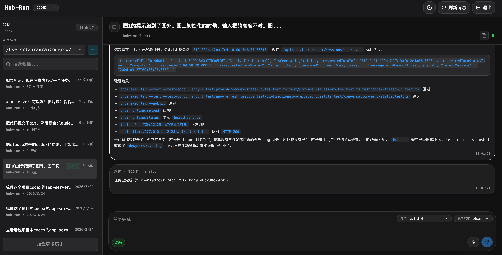
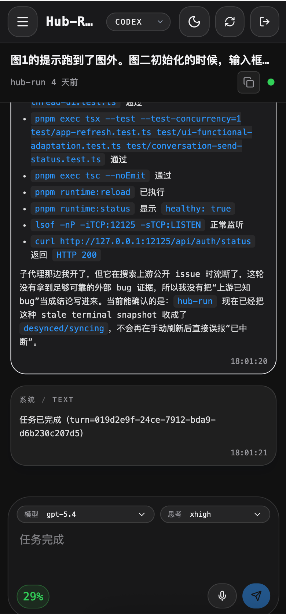

# hub-run

> 面向本地 Codex / Claude CLI 会话的统一 Web 浏览壳，支持实时流式更新与语音输入。

[English](./README.md)

---

## 截图

<p align="center">
  
</p>

<p align="center">
  
</p>

---

## 与同类项目的对比

| | [codex-run](https://github.com/asfsdsf/codex-run) | [claude-run](https://github.com/kamranahmedse/claude-run) | happy | **hub-run** |
|---|---|---|---|---|
| Codex 支持 | ✅ | ❌ | ✅ | ✅ |
| Claude 支持 | ❌ | ✅ | ✅ | ✅（基础） |
| 多 provider 统一 UI | ❌ | ❌ | ✅ | ✅ |
| 实时同步 | ❌ | ❌ | ✅ | ✅ |
| 语音输入 / 控制 | ❌ | ❌ | ✅ | ✅ |
| 中断 / thread 状态 | ❌ | ❌ | ❌ | ✅ |
| 用户输入请求 | ❌ | ❌ | ❌ | ✅ |

**codex-run / claude-run** 是单 provider 的简单壳，没有流式推送，依赖轮询或页面刷新来显示新消息。

**happy** 是面向 Claude Code / Codex 的移动端 + Web 客户端，配套 CLI wrapper，通过端到端加密做远程接管与实时同步。**hub-run** 则是自托管的本地 HTTP 浏览壳，直接服务自己的 React UI，并直接连本机 provider，不依赖配套 App 或 relay 服务。

如果你要的是“手机 / Web 远程接管 + 端到端加密同步”，并且接受通过 `happy` / `happy codex` 这层 wrapper 来启动会话，那更适合用 **happy**。如果你要的是“给现有本地 Codex / Claude 工作流加一个浏览器壳”，继续直接使用原生 `codex` / `claude` 命令，不想先套一层 wrapper，就更适合用 **hub-run**。

> Claude 方面由于官方已提供完善的 Web Channel，本项目在 Claude 支持上投入相对有限，重心放在 Codex 的完整交互体验上。

---

## 原理

```
Browser (React SPA)
    │  HTTP + SSE
    ▼
Hono API Server (Node.js)
    ├── Codex Provider  ──► codex app-server（JSON-RPC over stdio）
    │                           thread/start · turn/create · thread/resume
    └── Claude Provider ──► claude CLI（每次发消息 spawn 子进程）
```

### Codex

通过 JSON-RPC over stdio 与持久化的 `codex app-server` 进程通信。会话文件存储在 `~/.codex/sessions/*.jsonl`，由文件系统 Watcher 监听变更，经 SSE 实时推送到浏览器，无需轮询。

核心 RPC：`thread/start` → `turn/create` → `thread/read` / `thread/resume`

### Claude

每次发消息 spawn `claude --resume <id> --print` 子进程，解析 stdout JSON 事件流。会话文件在 `~/.claude/projects/**/*.jsonl`，同样通过 Watcher + SSE 推送。

### 实时推送

每个浏览器会话维护两条 SSE 长连接：
1. **会话列表流** — 文件变更时增量推送 upsert/remove
2. **消息流** — AI 生成过程中实时追加新消息

### 语音输入（ASR）

浏览器采集麦克风 PCM 音频，通过 WebSocket 流式上传到 hub-run API。API 将音频转发给可插拔的 ASR 提供方（当前为 **[豆包 / 字节流式 ASR](https://github.com/starccy/doubaoime-asr)**，基于 Protobuf over WebSocket 协议）。识别结果（中间态 + 最终态）实时推回浏览器，填入输入框。

ASR 接口为抽象层，可接入其他提供方（Whisper 等）。

---

## 当前能力

- `password` 登录与 `HttpOnly` cookie 鉴权
- 非 `loopback` host 下强制要求配置密码
- 统一 provider 路由（sessions / messages / state / interrupt / user-input）
- Codex 会话读取：`~/.codex/sessions/*.jsonl`
- Codex 新建会话：Web 侧先创建 draft 占位，首次发送时通过 `codex app-server` 真正创建
- Codex 发送：`turn/create`，暴露 thread state / interrupt / user input request
- Codex 消息流：SSE 增量推送 + 轮询兜底
- Claude 会话读取：`~/.claude/projects/**/*.jsonl`
- Claude 发送：spawn `claude --resume <id> --print`
- 语音输入：浏览器 PCM → WebSocket → 豆包 ASR → 实时转写回填
- latest-first 消息加载 + `before` cursor 历史翻页
- 移动端抽屉 + 桌面双栏布局
- 任务状态消息：`任务已开始（turn=xxx）` / `任务已完成（turn=xxx）`

## 不包含

- 协作模式
- `opencode` / `gemini`
- OAuth / RBAC / 多用户

---

## 快速开始

```bash
pnpm install
pnpm build

# 后台服务（推荐，macOS launchd 托管）
pnpm runtime:install -- --port 12125 --password your-password \
  --trusted-origin http://127.0.0.1 \
  --trusted-origin http://localhost

# 开发模式
pnpm dev
```

### 后台服务管理

```bash
pnpm runtime:install    # 注册为系统服务
pnpm runtime:start      # 启动
pnpm runtime:stop       # 停止
pnpm runtime:restart    # 重启
pnpm runtime:status     # 查看状态
pnpm runtime:reload     # 构建并重启
pnpm runtime:uninstall  # 卸载
```

### macOS 守护启动

在 macOS 上，`pnpm runtime:install` 会把 hub-run 注册成 `launchd` 的用户级守护服务，这样关闭当前终端后服务也能继续在后台运行。运行时配置会写到 `~/.config/hub-run/`，LaunchAgent plist 会写到 `~/Library/LaunchAgents/`。

常用验活命令：

```bash
pnpm runtime:status
lsof -nP -iTCP:12125 -sTCP:LISTEN
curl -i http://127.0.0.1:12125/api/auth/status
```

### 跨域反代场景

```bash
node dist/index.js \
  --host 127.0.0.1 --port 12001 \
  --password your-password \
  --trusted-origin http://127.0.0.1 \
  --trusted-origin http://localhost \
  --no-open
```

## 前置要求

- Node.js >= 20
- [Codex CLI](https://github.com/openai/codex)（`codex` 命令可用）
- [Claude CLI](https://github.com/anthropics/claude-code)（可选）
- 语音功能：**无需手动配置凭据**，首次使用时自动向豆包注册设备，凭据缓存于 `~/.config/hub-run/asr/doubao-credentials.json`

### 环境变量

| 变量 | 默认 | 说明 |
|------|------|------|
| `HUB_RUN_ENABLE_DOUBAO_ASR` | 启用 | 设为 `0` / `false` / `off` / `no` 可关闭语音输入 |

## 测试

```bash
pnpm test
```

使用 `test/fixtures/home/` 下的脱敏 fixture，覆盖：

- Codex / Claude 会话解析
- latest-first 消息加载 + `before` cursor 翻页
- 发送路由参数校验与 adapter 委托
- `sessionKey` round-trip
- 鉴权与登录流程

## 技术栈

| 层 | 技术 |
|----|------|
| 前端 | React 19 + Vite + Tailwind CSS v4 |
| 后端 | Hono + Node.js |
| 实时 | SSE（会话列表 + 消息流）+ WebSocket（ASR） |
| 语音 | [豆包流式 ASR](https://github.com/starccy/doubaoime-asr)（Protobuf over WebSocket） |
| 构建 | tsup (API) + Vite (Web) |

## Credits

灵感来源于 [codex-run](https://github.com/asfsdsf/codex-run) 与 [claude-run](https://github.com/kamranahmedse/claude-run)。
